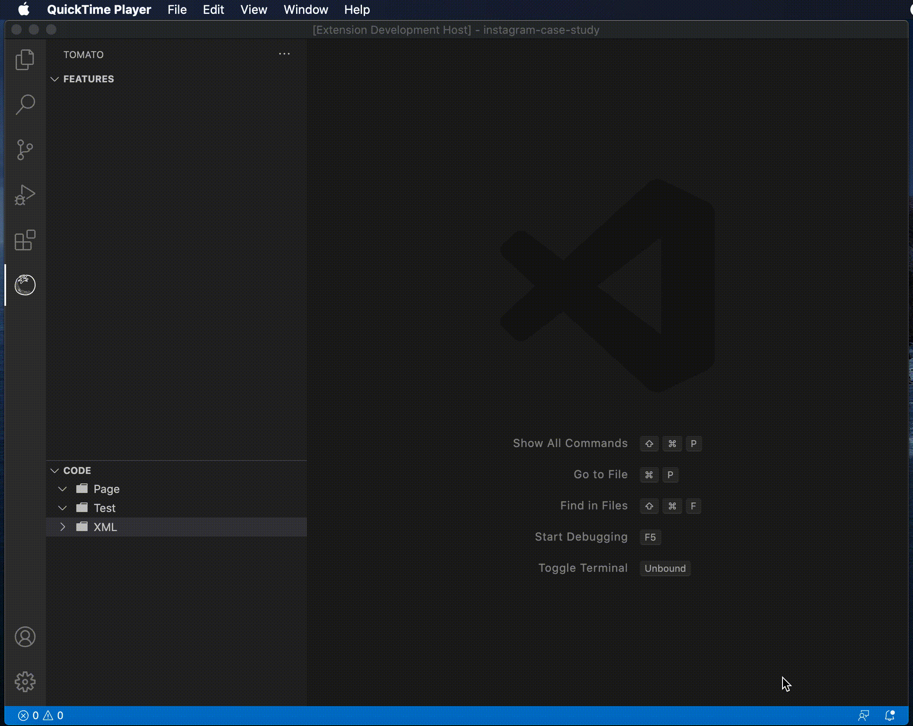

# tomato README

You can create your maven test automation project for mobile applications based on feature files which are written in cherry language. 

## How to Configure Maven Project to Tomato

> Tip: Do not forget your project is maven

## Requirements

Your automation project should be created as maven project.

## Known Issues

Calling out known issues can help limit users opening duplicate issues against your extension.

## Release Notes

You can create and generate your automation project code with cherry language. 

### 1.0.0

Initial release of Tomato

-----------------------------------------------------------------------------------------------------------

## Example Projects created with Tomato

Instagram Android 

**Enjoy!**
